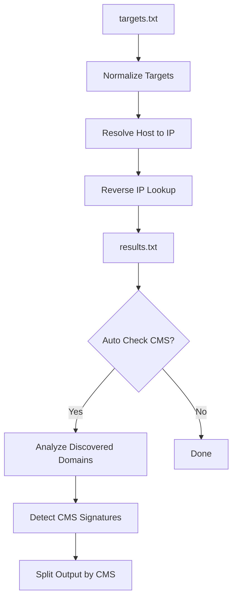

<p align="center">
  
</p>

<p align="center">
  
</p>

<p align="center">
  <a href="https://github.com/AnggaTechI"></a>
  
  
  
  
  
</p>

---

# ⚡ Mass Reverse IP Auto Check CMS

> ### High-performance reverse IP scanner with optional Auto Check CMS for WordPress, Joomla, Drupal, Laravel, and more.

---

## 🩸 What is this?

**Mass Reverse IP Auto Check CMS** is a high-speed terminal tool built to handle large target lists and keep output clean, organized, and easy to review.

Feed it **IPs, domains, or URLs**, let it rip through reverse IP collection, and when needed, continue directly into **Auto Check CMS** mode to sort discovered domains into platform-based result files.

This project is built around:

- **async reverse IP processing**
- **optional Auto Check CMS**
- **live terminal progress**
- **per-CMS output separation**
- **fast workflow for large batches**

---

## 🔥 Core Features

<table>
<tr>
<td width="50%">

### ⚔ Reverse IP Engine
- Fast async worker pipeline
- Mixed target support
- Input normalization
- Domain/IP de-duplication
- Large-list friendly flow

</td>
<td width="50%">

### 🧠 Auto Check CMS
- Optional CMS stage after reverse IP
- Per-CMS output split
- Quick signature-based detection
- Clean file separation
- Easy review workflow

</td>
</tr>
</table>

---

## 💀 Supported CMS

<p align="center">
  
  
  
  
  
  
  
  
  
  
  
</p>

---

## 🧨 Workflow



---

## 🚀 Installation

```bash
python -m pip install aiohttp aiodns
python main.py
```

---

## ⚙ Usage

When the tool runs, you will be prompted for:

- **input file**
- **Auto Check CMS mode**
- **concurrency value**

### Example input

```txt
1.1.1.1
8.8.8.8
example.com
https://target.tld/path
sub.target.tld
```

---

## 📂 Output Structure

### Main output

```txt
results.txt
```

### CMS output files

```txt
wordpress.txt
laravel.txt
joomla.txt
drupal.txt
magento.txt
shopify.txt
codeigniter.txt
prestashop.txt
opencart.txt
vbulletin.txt
phpbb.txt
```

---

## 🖥 Terminal Style

This project is made to feel alive in the terminal:

- custom colored banner
- live counters
- progress rendering
- summary breakdown
- fast visual feedback during execution

---

## 🛡 Notes

- Reverse IP results depend on the upstream API response.
- Auto Check CMS is signature-based, so some targets may remain unknown.
- Use this tool only on infrastructure you manage or are authorized to assess.

---

## 👑 Author

<p align="center">
  <a href="https://github.com/AnggaTechI">
    
  </a>
</p>

<p align="center">
  <b>AnggaTechI</b><br>
  <a href="https://github.com/AnggaTechI">github.com/AnggaTechI</a>
</p>

<p align="center">
  
</p>
