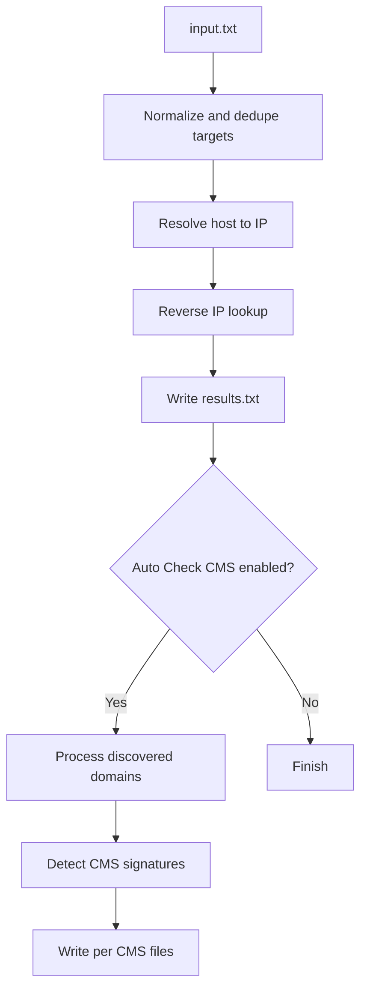

<p align="center">
  
</p>

<p align="center">
  
</p>

<p align="center">
  <a href="https://github.com/AnggaTechI">
    
  </a>
  
  
  
  
  
</p>

---

# Mass Reverse IP Auto Check CMS

> **High-performance reverse IP scanner with optional Auto Check CMS for WordPress, Joomla, Drupal, Laravel, and more.**

## Overview

**Mass Reverse IP Auto Check CMS** is a fast terminal-based Python tool for processing mixed targets such as **IP addresses, domains, and URLs**, then performing **reverse IP lookup** and optionally continuing with **Auto Check CMS** detection. The current script supports async lookup workers, optional CMS workers, per-CMS output files, mixed input normalization, and live terminal progress rendering.

Built for speed and clean terminal output, this tool helps you collect discovered domains quickly and optionally separate them into CMS-based result files for faster review.

---

## Features

- Fast **async reverse IP lookup**
- Accepts **IP / domain / URL** targets in one file
- Optional **Auto Check CMS** after reverse IP lookup
- Writes all unique discovered domains to `results.txt`
- Separate per-CMS output files
- Live terminal progress with lookup, IP, domain, and CMS counters
- Windows and Linux support
- Input and result de-duplication
- Clean terminal UI with colored banner and summary output

---

## Supported CMS

<p align="center">
  
  
  
  
  
  
  
  
  
  
  
</p>

---

## How It Works



---

## Installation

Install dependencies:

```bash
python -m pip install aiohttp aiodns
```

Run the tool:

```bash
python main.py
```

---

## Usage

When the script starts, it will ask for:

- **Input file**
- **Enable Auto Check CMS?**
- **Concurrency value**

### Example input file

```txt
1.1.1.1
8.8.8.8
example.com
https://target.tld/path
sub.target.tld
```

---

## Output Files

### Main Output

```txt
results.txt
```

### CMS Output

```txt
wordpress.txt
laravel.txt
joomla.txt
drupal.txt
magento.txt
shopify.txt
codeigniter.txt
prestashop.txt
opencart.txt
vbulletin.txt
phpbb.txt
```

---

## Performance

- Async worker-based processing
- Separate reverse IP and Auto Check CMS stages
- Optimized defaults for Windows and Linux
- Fast DNS resolution path depending on platform
- Live progress updates during execution

---

## Terminal Preview

```text
[INPUT]
› File input  : targets.txt
› Active CMS detection? (Y/n) : y
› Concurrency (default=200, max=2000) : 200

▸ Total target  : 10,000
▸ Mode          : Reverse IP + Auto Check CMS
▸ Concurrency   : 200 (lookup) + 400 (cms)
▸ Output all    : results.txt
```

---

## Why This Tool

- Fast processing for large target lists
- Clean output separation by CMS
- Easy terminal workflow
- Good balance between speed and readable output
- Simple setup and direct execution

---

## Notes

- Reverse IP results depend on the upstream API response.
- Auto Check CMS is signature-based, so custom or heavily modified sites may appear as unknown.
- Use this tool only on infrastructure you manage or are authorized to assess.

---

## Author

<p align="center">
  <a href="https://github.com/AnggaTechI">
    
  </a>
</p>

<p align="center">
  <b>AnggaTechI</b><br>
  <a href="https://github.com/AnggaTechI">github.com/AnggaTechI</a>
</p>

<p align="center">
  
</p>
